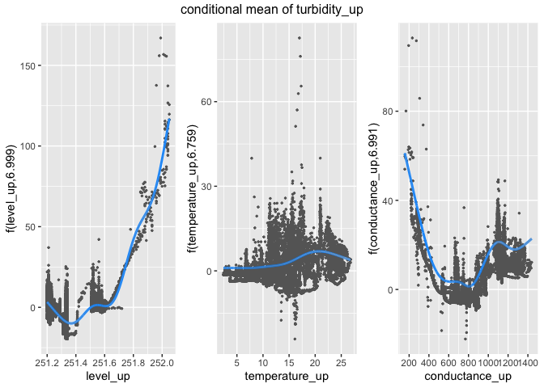

<!-- README.md is generated from README.Rmd. Please edit that file -->

# conduits (CONDitional UI for Time Series normalization)

<!-- badges: start -->

<!-- badges: end -->

Package `conduits` provides an user interface for conditionally
normalising a time series. This also facilitates functions to produce
conditional cross-correlations between two normalised time series at
different lags while providing some graphical tools for visualisation.

`conduits` can also be used to estimate the time delay between two
sensor locations in river systems.

## Installation

You can install `conduits` from github with:

``` r
# install.packages("devtools")
devtools::install_github("PuwasalaG/conduits")
```

## Example

This is a basic example which shows you how to use functions in
`conduits`:

`conduits` contains a set of water-quality variables measured by in-situ
sensors from the Pringle Creek located in Wise County, Texas. This is
one of the aquatic NEON field sites hosted by the US Forest Service.

This data contains water-quality variables such as, turbidity, specific
conductance, dissolved oxygen, pH and fDOM along with surface elevation
and surface temperature from two sites located about 200m apart. Data
are available from \(2019-07-01\) to \(2019-12-31\) at every 5 mintues.

In this example we choose turbidity from upstream and downstream sites
to calculate the cross-correlation while conditioning on level,
temperature and conductance from the upstream location.

Let us first prepare data as follows

``` r
library(conduits)
#> Loading required package: ggplot2
library(lubridate)
#> 
#> Attaching package: 'lubridate'
#> The following objects are masked from 'package:base':
#> 
#>     date, intersect, setdiff, union
library(tidyverse)
#> ── Attaching packages ─────────────────────────────────────── tidyverse 1.3.0 ──
#> ✓ tibble  3.0.4     ✓ dplyr   1.0.2
#> ✓ tidyr   1.1.2     ✓ stringr 1.4.0
#> ✓ readr   1.3.1     ✓ forcats 0.5.0
#> ✓ purrr   0.3.4
#> ── Conflicts ────────────────────────────────────────── tidyverse_conflicts() ──
#> x lubridate::as.difftime() masks base::as.difftime()
#> x lubridate::date()        masks base::date()
#> x dplyr::filter()          masks stats::filter()
#> x lubridate::intersect()   masks base::intersect()
#> x dplyr::lag()             masks stats::lag()
#> x lubridate::setdiff()     masks base::setdiff()
#> x lubridate::union()       masks base::union()

data_z <- NEON_PRIN_5min_cleaned %>% 
  filter(Timestamp >= ymd("2019-10-01") 
         & Timestamp < ymd("2020-01-01"),
         site == "upstream") %>%
  select(Timestamp, level, conductance, temperature) %>% 
  rename("level_up" = level,
         "conductance_up" = conductance,
         "temperature_up" = temperature)

data_xy <- NEON_PRIN_5min_cleaned %>% 
  filter(Timestamp >= ymd("2019-10-01") 
         & Timestamp < ymd("2020-01-01")) %>% 
  select(Timestamp, site, turbidity) %>% 
  tidyr::spread(key = site, value = turbidity) %>% 
  rename("turbidity_up" = upstream,
         "turbidity_down" = downstream)

data_normalisation <- data_xy %>% 
  left_join(data_z, by = "Timestamp")

head(data_normalisation)
#> # A tibble: 6 x 6
#>   Timestamp           turbidity_down turbidity_up level_up conductance_up
#>   <dttm>                       <dbl>        <dbl>    <dbl>          <dbl>
#> 1 2019-10-01 00:00:00           1.61         2.08     251.           761 
#> 2 2019-10-01 00:05:00           1.59         1.68     251.           761.
#> 3 2019-10-01 00:10:00           1.81         1.67     251.           761.
#> 4 2019-10-01 00:15:00           1.66         1.54     251.           760.
#> 5 2019-10-01 00:20:00           1.63         1.48     251.           761.
#> 6 2019-10-01 00:25:00           1.66         1.38     251.           761.
#> # … with 1 more variable: temperature_up <dbl>
```

### Conditional normalisation

The following code shows how to use the `conditional_moments` function
to normalise turbidity from upstream sites.

``` r

cond_moments_x <- data_normalisation %>% 
  conditional_moments(x = turbidity_up,
                      z_numeric = c(level_up, temperature_up,
                                    conductance_up),
                      knots_mean = c(8,8,8),
                      knots_variance = c(7,7,7))
head(cond_moments_x$data_conditional_moments)
#> # A tibble: 6 x 8
#>   Timestamp           turbidity_down turbidity_up level_up conductance_up
#>   <dttm>                       <dbl>        <dbl>    <dbl>          <dbl>
#> 1 2019-10-01 00:00:00           1.61         2.08     251.           761 
#> 2 2019-10-01 00:05:00           1.59         1.68     251.           761.
#> 3 2019-10-01 00:10:00           1.81         1.67     251.           761.
#> 4 2019-10-01 00:15:00           1.66         1.54     251.           760.
#> 5 2019-10-01 00:20:00           1.63         1.48     251.           761.
#> 6 2019-10-01 00:25:00           1.66         1.38     251.           761.
#> # … with 3 more variables: temperature_up <dbl>, E_turbidity_up <dbl>,
#> #   Var_turbidity_up <dbl>
```

We can then visualise the fitted models for conditional means and
variances by passing the `cond_moments_x` object to the `autoplot`
method.

``` r

autoplot(cond_moments_x, type = "mean")
```


