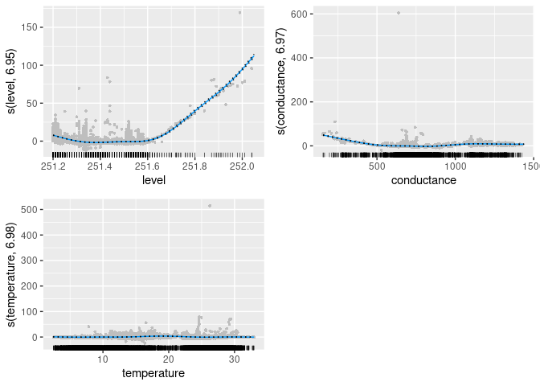

<!-- README.md is generated from README.Rmd. Please edit that file -->

# conduits (CONDitional UI for Time Series normalisation)


<!-- badges: start --> <!-- badges: end -->

Package `conduits` provides an user interface for conditionally
normalising a time series. This also facilitates functions to produce
conditional cross-correlations between two normalised time series at
different lags while providing some graphical tools for visualisation.

`conduits` can also be used to estimate the time delay between two
sensor locations in river systems.

## Installation

You can install `conduits` from github with:

``` r
# install.packages("devtools")
devtools::install_github("PuwasalaG/conduits")
```

## Example

This is a basic example which shows you how to use functions in
`conduits`:

`conduits` contains a set of water-quality variables measured by in-situ
sensors from the Pringle Creek located in Wise County, Texas. This is
one of the aquatic NEON field sites hosted by the US Forest Service.

This data contains water-quality variables such as, turbidity, specific
conductance, dissolved oxygen, pH and fDOM along with surface elevation
and surface temperature from two sites located about 200m apart. Data
are available from $2019-07-01$ to $2019-12-31$ at every 5 mintues.

In this example we choose turbidity from upstream and downstream sites
to calculate the cross-correlation while conditioning on level,
temperature and conductance from the upstream location.

Let us first prepare data as follows

``` r
library(conduits)
library(tidyverse)
```

# Data

`conduits` contains `NEON_PRIN_5min_cleaned`, a set of water-quality
variables measured by in-situ sensors from Pringle Creek located in Wise
County, Texas. This is one of the aquatic NEON field sites hosted by the
US Forest Service.

This data contains water-quality variables such as turbidity, specific
conductance, dissolved oxygen, pH and fDOM along with surface elevation
and surface temperature from two sites located about 200m apart. Data
are available from $2019-07-01$ to $2019-12-31$ at every 5 minutes.

In this example, we choose turbidity from upstream and downstream sites
to calculate the cross-correlation while conditioning on the water
level, temperature and conductance from the upstream location.

Let us first prepare data as follows

``` r
data <- NEON_PRIN_5min_cleaned %>%
  dplyr::filter(site == "upstream") %>%
  dplyr::select(Timestamp, turbidity, level,
                conductance, temperature) %>%
  tsibble::as_tsibble(index = Timestamp)
head(data)
#> # A tsibble: 6 x 5 [5m] <UTC>
#>   Timestamp           turbidity level conductance temperature
#>   <dttm>                  <dbl> <dbl>       <dbl>       <dbl>
#> 1 2019-07-01 00:00:00     1.55   251.        821.        29.6
#> 2 2019-07-01 00:05:00     1.1    251.        821.        29.6
#> 3 2019-07-01 00:10:00     0.855  251.        821.        29.5
#> 4 2019-07-01 00:15:00     0.87   251.        821.        29.5
#> 5 2019-07-01 00:20:00     1.01   251.        821.        29.4
#> 6 2019-07-01 00:25:00     0.828  251.        821.        29.4
```

### Conditional normalisation

The following code shows how to normalise downstream turbidity from
upstream sites.

``` r
# Estimating conditional mean of the turbidity from the upstream site 

fit_mean <- data %>%
  conditional_mean(
    turbidity ~ s(level, k = 8) + s(conductance, k = 8) + s(temperature, k = 8))

summary(fit_mean)
#> 
#> Family: gaussian 
#> Link function: identity 
#> 
#> Formula:
#> turbidity ~ s(level, k = 8) + s(conductance, k = 8) + s(temperature, 
#>     k = 8)
#> 
#> Parametric coefficients:
#>             Estimate Std. Error t value Pr(>|t|)    
#> (Intercept)  4.25221    0.02438   174.4   <2e-16 ***
#> ---
#> Signif. codes:  0 '***' 0.001 '**' 0.01 '*' 0.05 '.' 0.1 ' ' 1
#> 
#> Approximate significance of smooth terms:
#>                  edf Ref.df       F p-value    
#> s(level)       6.945  6.998 3059.76  <2e-16 ***
#> s(conductance) 6.974  7.000 1596.37  <2e-16 ***
#> s(temperature) 6.979  7.000   65.78  <2e-16 ***
#> ---
#> Signif. codes:  0 '***' 0.001 '**' 0.01 '*' 0.05 '.' 0.1 ' ' 1
#> 
#> R-sq.(adj) =  0.687   Deviance explained = 68.7%
#> GCV = 29.604  Scale est. = 29.591    n = 49796
class(fit_mean)
#> [1] "conditional_moment" "gam"                "glm"               
#> [4] "lm"

# Visualizing the fitted smooth functions  in the conditional mean model for turbidity  downstream with the predictors, water level  and temperature from upstream sensor.

# using plotting functions in mgcViz package
library(mgcViz)
viz_mean <- mgcViz::getViz(fit_mean)
p <- plot(viz_mean, allTerms = T) +
  l_points(size = 1, shape = 16, color = "gray") +
  l_fitLine(linetype = 1, color = "#0099FF") +
  l_ciLine(linetype = 3) +
  l_ciBar() +
  l_rug() +
  theme_grey()

p$plots[[1]] <- p$plots[[1]] 
p$plots[[2]] <- p$plots[[2]] 
print(p, pages = 1)
```



``` r


# Estimating conditional variance of the turbidity from the upstream site 

fit_var <- data %>%
  conditional_var(
    turbidity ~ s(level, k = 7) + s(conductance, k = 7) + s(temperature, k = 7),
    family = "Gamma",
    fit_mean
  )

class(fit_var)
#> [1] "conditional_moment" "gam"                "glm"               
#> [4] "lm"
summary(fit_var)
#> 
#> Family: Gamma 
#> Link function: log 
#> 
#> Formula:
#> Y_Ey2 ~ s(level, k = 7) + s(conductance, k = 7) + s(temperature, 
#>     k = 7)
#> 
#> Parametric coefficients:
#>             Estimate Std. Error t value Pr(>|t|)    
#> (Intercept)  1.86626    0.06525    28.6   <2e-16 ***
#> ---
#> Signif. codes:  0 '***' 0.001 '**' 0.01 '*' 0.05 '.' 0.1 ' ' 1
#> 
#> Approximate significance of smooth terms:
#>                  edf Ref.df     F p-value    
#> s(level)       5.977  6.000 59.28  <2e-16 ***
#> s(conductance) 5.855  5.990 18.93  <2e-16 ***
#> s(temperature) 5.960  5.999 33.12  <2e-16 ***
#> ---
#> Signif. codes:  0 '***' 0.001 '**' 0.01 '*' 0.05 '.' 0.1 ' ' 1
#> 
#> R-sq.(adj) =  -0.0112   Deviance explained =   38%
#> GCV = 4.9694  Scale est. = 212.02    n = 49796

# Normalize the series using conditional moments
new_ts <- data %>%
  dplyr::mutate(
    ystar = normalize(., turbidity, fit_mean, fit_var))
```

### Conditional cross-correlation

The following code shows how to compute conditional cross-correlation
between upstream and downstream at given lags

``` r
old_ts <- NEON_PRIN_5min_cleaned %>%
  dplyr::select(
    Timestamp, site, turbidity, level,
    conductance, temperature
  ) %>%
  tidyr::pivot_wider(
    names_from = site,
    values_from = turbidity:temperature
  )

fit_mean_y <- old_ts %>%
  conditional_mean(turbidity_downstream ~
  s(level_upstream, k = 8) +
    s(conductance_upstream, k = 8) +
    s(temperature_upstream, k = 8))

fit_var_y <- old_ts %>%
  conditional_var(
    turbidity_downstream ~
    s(level_upstream, k = 7) +
      s(conductance_upstream, k = 7) +
      s(temperature_upstream, k = 7),
    family = "Gamma",
    fit_mean_y
  )

fit_mean_x <- old_ts %>%
  conditional_mean(turbidity_upstream ~
  s(level_upstream, k = 8) +
    s(conductance_upstream, k = 8) +
    s(temperature_upstream, k = 8))

fit_var_x <- old_ts %>%
  conditional_var(
    turbidity_upstream ~
    s(level_upstream, k = 7) +
      s(conductance_upstream, k = 7) +
      s(temperature_upstream, k = 7),
    family = "Gamma",
    fit_mean_x
  )

fit_c_ccf <- old_ts %>%
  tidyr::drop_na() %>%
  conditional_ccf(
    I(turbidity_upstream * turbidity_downstream) ~ splines::ns(
      level_upstream,
      df = 5
    ) +
      splines::ns(temperature_upstream, df = 5),
    lag_max = 10,
    fit_mean_x, fit_var_x, fit_mean_y, fit_var_y,
    df_correlation = c(5, 5)
  )
```

Visualizing the fitted smooth functions for conditional
cross-correlation between turbidity-upstream and turbidity-downstream at
lag 1 with the predictors water level and temperature from upstream
sensor.

Compute lag time between upstream and downstream sensors with the
predictors, water level and temperature from upstream sensor

``` r
Estimate_dt <- fit_c_ccf %>% conduits::estimate_dt()
```

Visualize the estimated lag time between upstream and downstream sensors

``` r
p <- Estimate_dt %>%
  select(Timestamp, turbidity_downstream, turbidity_upstream,
         dt, max_ccf) %>%
  drop_na() %>%
  pivot_longer(cols = turbidity_downstream:max_ccf) %>%
  mutate(name = factor(
    name, 
    levels = c("turbidity_downstream", "turbidity_upstream" ,
               "dt", "max_ccf"),
    labels = c("(a) Turbidity-downstream", "(b) Turbidity-upstream" ,
               "(c) Lag time (dt)", "(d) Maximum conditional cross-correlation"))) %>%
  tsibble::as_tsibble(index = Timestamp, key = name) %>%
  fabletools::autoplot(colour="black") +
  facet_wrap(~name, nrow = 4, scale ="free_y") +
  theme(legend.position = "none")

print(p)
```


